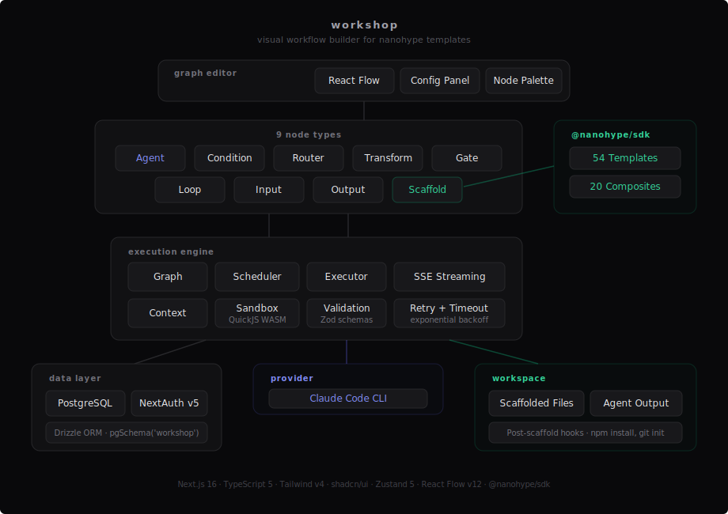
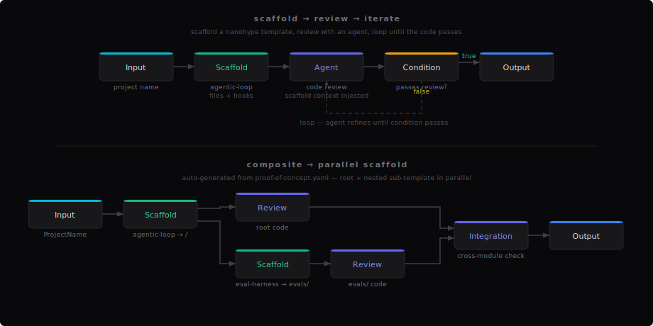

# workshop

Visual workflow builder for [nanohype](https://github.com/nanohype/nanohype) templates. Design graph-based pipelines where each node is a Claude Code session — scaffold templates, chain agent review passes, and generate full workflows from composites.

Part of the [nanohype](https://github.com/nanohype) ecosystem.

## Architecture

<picture>
  <source media="(prefers-color-scheme: dark)" srcset="docs/workshop.svg">
  
</picture>

## Workflow Pipelines

<picture>
  <source media="(prefers-color-scheme: dark)" srcset="docs/workflow-pipeline.svg">
  
</picture>

## Node Types

| Node | Purpose |
|------|---------|
| **Claude Code** | Execute a Claude Code session with a system prompt |
| **Scaffold** | Render a nanohype template into the workspace |
| **Condition** | True/false branching via JavaScript expressions |
| **Router** | Multi-way branching with N labeled routes |
| **Transform** | Data shaping with `{{variable}}` interpolation (no LLM) |
| **Gate** | Pause for manual approval before continuing |
| **Loop** | Repeat until a condition is met |
| **Input** | Workflow entry point |
| **Output** | Workflow exit point |

## nanohype Integration

- **Scaffold node** renders any of the 54 nanohype templates into the workflow workspace via `@nanohype/sdk`, with automatic post-hook execution (`npm install`, `git init`, etc.)
- **Template browser** for searching, filtering, and previewing templates from within the editor
- **Composite workflows** auto-generate scaffold + review agent pipelines from nanohype composites
- **Template-aware agents** receive structured scaffold context (file tree, variables, warnings) when following a scaffold node
- **Variable bridging** passes upstream node outputs to template variables via `{{variable}}` interpolation

## Prerequisites

- [Node.js](https://nodejs.org/) 20+
- [Claude Code](https://docs.anthropic.com/en/docs/claude-code) CLI installed and authenticated
- PostgreSQL 16+

## Setup

```bash
# Install dependencies
pnpm install

# Start PostgreSQL
docker compose up -d

# Configure environment
cp .env.example .env
# Edit .env — set AUTH_SECRET and AUTH_PASSWORD

# Initialize database
pnpm db:push

# Start dev server
pnpm dev
```

## Stack

- Next.js 16 (App Router) + TypeScript
- React Flow for the graph editor
- Zustand for state management
- Drizzle ORM + PostgreSQL
- Tailwind CSS v4 + shadcn/ui
- `@nanohype/sdk` for template rendering

## License

Apache-2.0
